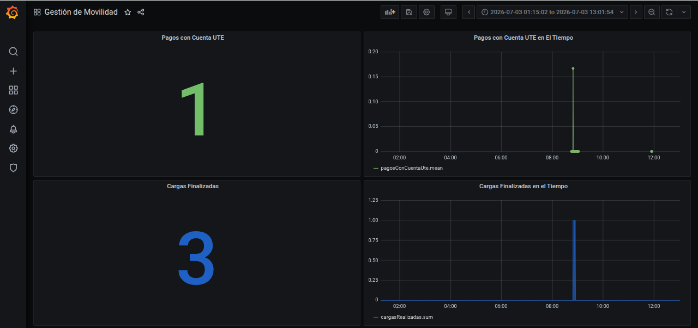
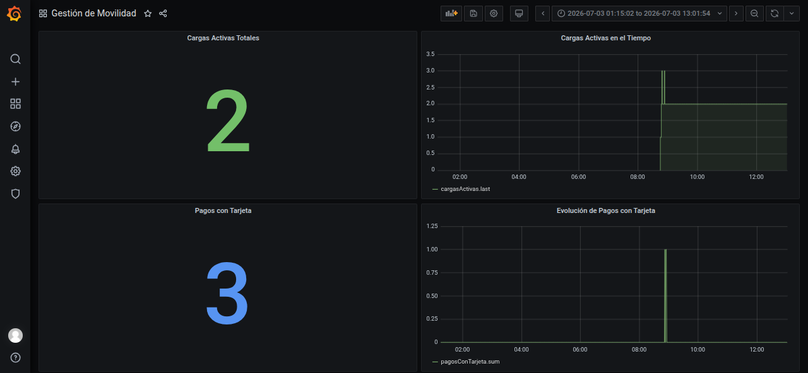
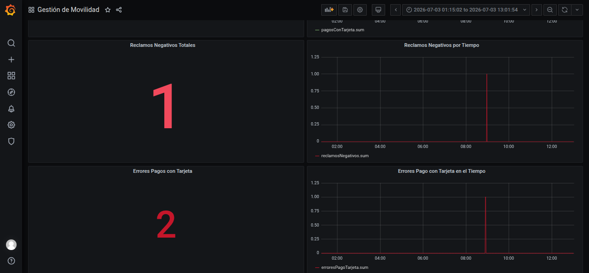
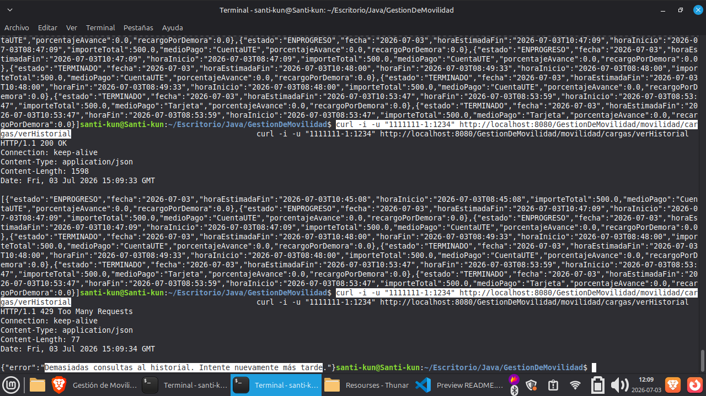

# 🚗 GestionDeMovilidad

## 📖 Descripción del Proyecto

GestionDeMovilidad es un sistema que permite administrar el proceso completo de carga de vehículos eléctricos. Desde el registro de usuarios y medios de pago hasta el uso de estaciones de carga y el procesamiento de pagos, el sistema busca facilitar y organizar las distintas operaciones relacionadas con la movilidad eléctrica.

---

## 🎯 Objetivo

El objetivo del proyecto es desarrollar una aplicación que permita gestionar de forma simple y organizada el proceso de carga de vehículos eléctricos, aplicando una estructura modular para mantener el sistema ordenado y facilitar futuras mejoras y ampliaciones.
También busca aplicar conceptos como inyección de dependencias, comunicación mediante eventos y separación de responsabilidades entre módulos.

---

## ✨ Funcionalidades

- Registrar clientes.
- Agregar medios de pago.
- Gestionar estaciones y cargadores.
- Iniciar y finalizar cargas.
- Consultar cargas realizadas.
- Procesar pagos.
- Consultar pagos.
- Realizar reclamos.
- Visualizar estaciones disponibles.

---

## 🛠 Tecnologías Utilizadas

- **Java**: lenguaje principal del proyecto.
- **Jakarta EE 10**: APIs utilizadas para el desarrollo de la aplicación.
- **WildFly**: servidor de aplicaciones utilizado para desplegar el proyecto.
- **Maven**: gestión de dependencias, compilación y empaquetado del proyecto.
- **JUnit 5**: ejecución de pruebas unitarias.
- **Mockito**: creación de mocks para pruebas.
- **AssertJ**: assertions más expresivas en los tests.
- **Lombok**: generación automática de código repetitivo como getters, setters y constructores.
- **JBoss Logging**: registro de mensajes y errores de la aplicación.
- **Bucket4j**: librería utilizada para implementar rate limiting, lo que permite limitar y controlar la cantidad de peticiones que recibe tu API para evitar sobrecargas o abusos.
- **Micrometer**: (InfluxDB): fachada de registro de métricas de la aplicación.

---

## 🏗 Arquitectura del Sistema

El sistema se encuentra organizado mediante una arquitectura modular.

La estructura se divide principalmente en:

- Dominio: contiene las entidades y reglas de negocio.
- Aplicación: contiene los casos de uso y lógica de aplicación.
- Interfaces: permite la comunicación entre módulos y el manejo de eventos.
- Infraestructura: contiene configuraciones y mecanismos de persistencia.


## 📂 Estructura del Proyecto
    
    src/main/java/
    │
    ├── FuncionalidadCargadorMOCK.aplicacion/
    │
    ├── infraestructura/
    │   ├── inicio/
    │   └── seguridad/
    │
    ├── moduloCarga/
    │   ├── aplicacion/
    │   ├── dominio/
    │   ├── infraestructura/
    │   └── interfaz/
    │
    ├── moduloCliente/
    │   ├── aplicacion/
    │   ├── dominio/
    │   ├── exepciones/
    │   ├── infraestructura/
    │   ├── interfaz/
    │   └── mapper/
    │
    ├── moduloMonitoreo/
    │   ├── infraestructura/
    │   └── interfaz.evento.in/
    │
    └── moduloPago/
        ├── aplicacion/
        ├── dominio/
        ├── infraestructura/
        └── interfaz/

---

## 📦 Módulos del Sistema

### 👤 Módulo Cliente
Responsable de la gestión de clientes registrados en el sistema, permitiendo el registro de usuarios, administración de medios de pago y realización de reclamos.

### ⚡ Módulo Carga
Responsable de administrar el proceso de carga de vehículos eléctricos, incluyendo el inicio y finalización de cargas, consulta de historial y gestión de estaciones y cargadores.

### 💳 Módulo Pago
Encargado de procesar y gestionar los pagos asociados a las cargas realizadas por los usuarios.

### 📊 Módulo Monitoreo
Encargado de la observabilidad del sistema. Recolecta métricas, procesa eventos de entrada (como telemetría o alertas) y facilita la integración con herramientas externas (como InfluxDB y Grafana) para supervisar la salud de la aplicación.

### 🛠️ Infraestructura Transversal (Inicio y Seguridad)
Gestiona configuraciones globales que afectan a toda la aplicación. Incluye la orquestación de arranque del sistema y el manejo de la seguridad, autenticación y autorización (utilizando Jakarta Security) para proteger los endpoints.

### 🔌 Funcionalidad Cargador MOCK
Módulo de apoyo utilizado para simular el comportamiento del hardware físico de los cargadores de vehículos eléctricos.

---

## 🌐 Servicios Externos Simulados

Además de los módulos principales, el proyecto incluye dos aplicaciones independientes (`.war`) que simulan la integración con proveedores externos de medios de pago.

Los servicios deben desplegarse en WildFly junto con la aplicación principal.

### 📦 Servicios incluidos

| Servicio | Archivo WAR | Descripción |
|----------|-------------|-------------|
| Mock Pago Cuenta UTE | `MockPagoCuentaUte.war` | Simula un proveedor externo encargado de procesar pagos mediante cuenta UTE. |
| Mock Medio de Pago | `ServicioMedioPagoMock.war` | Simula un proveedor externo encargado de procesar pagos realizados mediante tarjeta. |

Estos servicios representan APIs externas consumidas por el módulo de pagos mediante llamadas HTTP.

### 🔗 Endpoints de los Servicios Externos

Los siguientes endpoints corresponden a los servicios externos simulados que consume el módulo de pagos.

### ⚡ MockPagoCuentaUte

Permite simular el procesamiento de un pago utilizando una cuenta UTE.

| Método | Endpoint | Descripción |
|---------|----------|-------------|
| POST | `http://localhost:8080/MockPagoCuentaUte/api/medioPago/pagar` | Procesa un pago mediante una cuenta UTE. |

#### Body de la solicitud

```json
{
    "cuentaUte": "2323232",
    "monto": "2000",
    "clienteID": "333333"
}
```

| Campo | Descripción |
|--------|-------------|
| `cuentaUte` | Número de cuenta UTE utilizada para el pago. |
| `monto` | Monto a cobrar. |
| `clienteID` | Identificador del cliente que realiza el pago. |

---

### 💳 ServicioMedioPagoMock

Permite simular la autorización de pagos realizados mediante tarjeta.

| Método | Endpoint | Descripción |
|---------|----------|-------------|
| POST | `http://localhost:8080/ServicioMedioPagoMock/api/medioPago/autorizar` | Autoriza un pago utilizando una tarjeta. |

#### Body de la solicitud

```json
{
    "numeroTarjeta": "11111111",
    "monto": 350
}
```

| Campo | Descripción |
|--------|-------------|
| `numeroTarjeta` | Número de la tarjeta utilizada para realizar el pago. |
| `monto` | Monto a autorizar. |

#### Comportamiento del servicio

El servicio devuelve una respuesta diferente según el número de tarjeta enviado, permitiendo probar distintos escenarios del sistema:

| Número de tarjeta | Resultado |
|-------------------|-----------|
| `11111111` | Pago autorizado (HTTP 200). |
| `22222222` | Pago rechazado (HTTP 402). Esta tarjeta siempre genera un rechazo para facilitar las pruebas del manejo de deudas y pagos fallidos. |


---  
## 🚀 Manual de Despliegue y Ejecución

### 1. ⚙️ Requisitos Previos

Antes de ejecutar el proyecto es necesario tener instalado:
- Java JDK 21+
- Apache Maven
- MariaDB o MySQL (con la base de datos `Movilidad` creada)
- IDE compatible (Visual Studio Code o IntelliJ IDEA)
- Docker
- Grafana e InfluxDB
- Ollama en Contenedor Ollama
  
---

### 2. 📂 Clonar el Repositorio

Primero, clona el repositorio oficial en tu máquina local y accede al directorio raíz del proyecto:

```bash
# Clonar el proyecto (reemplaza con la URL correcta si es necesario)
git clone https://github.com/17Franco/GestionDeMovilidad

```

---

### 3. 🐳 Levantando la Infraestructura (Docker)
> ⚠️ **Nota:** Esta sección se ejecuta **solo la primera vez**, si todavía no existen los contenedores `docker-influxdb-grafana` y `ollama`. Si los contenedores ya existen en tu sistema, puedes saltar directamente al **Punto 4**.

1. Ver los contenedores existentes en el sistema:
   ```bash
   sudo docker ps -a
   ```
   
2. Crear el contenedor conjunto de InfluxDB + Grafana (Puertos: 3003 para Grafana, 8086 para InfluxDB y 3004/8083 para la interfaz administrativa):
   ```bash
   sudo docker run -d --name docker-influxdb-grafana -p 3003:3003 -p 8086:8086 -p 3004:8083 philhawthorne/docker-influxdb-grafana:latest
   ```
   
3. Crear el contenedor de Ollama:
   ```bash
   sudo docker run -d --name ollama -p 11434:11434 ollama/ollama
   ```

4. Descargar dentro del contenedor el modelo de lenguaje específico utilizado:
   ```bash
   sudo docker exec ollama ollama pull qwen2.5:0.5b
   ```
   
5. Verificar que ambos contenedores quedaron creados correctamente:
   ```bash
   docker ps -a
   ```
   
   **Salida esperada (similar a esto):**
   ```text
   CONTAINER ID   IMAGE                                         COMMAND                  CREATED        STATUS        PORTS                                                                                                                   NAMES
   b72d6975c156   ollama/ollama                                 "/bin/ollama serve"      3 hours ago    Up 3 hours    0.0.0.0:11434->11434/tcp, [::]:11434->11434/tcp                                                                          ollama
   66d4427b9de8   philhawthorne/docker-influxdb-grafana:latest   "/run.sh"                3 hours ago    Up 3 hours    0.0.0.0:3003->3003/tcp, [::]:3003->3003/tcp, 0.0.0.0:8086->8086/tcp, [::]:8086->8086/tcp, 0.0.0.0:3004->8083/tcp        docker-influxdb-grafana
   ```
---

### 4. ▶️ Arranque de la Infraestructura Docker
Si ya realizaste la instalación inicial, cada vez que vayas a trabajar en el proyecto debes asegurarte de iniciar los servicios con los siguientes comandos:

#### Paso A: Levantar InfluxDB y Grafana
1. Verificar el estado de los contenedores:
   ```bash
   docker ps -a
   ```
2. Iniciar el contenedor utilizado por el proyecto:
   ```bash
   docker start docker-influxdb-grafana
   ```
3. Verificar que esté corriendo (debe figurar con STATUS "Up"):
   ```bash
   docker ps
   ```

#### Capturas del Dashboard en Grafana

El dashboard **Gestión de Movilidad** permite visualizar métricas operativas del sistema, como pagos por Cuenta UTE, cargas finalizadas, cargas activas, pagos con tarjeta, reclamos negativos y errores de pago.







#### Paso B: Levantar Ollama
1. Iniciar el contenedor de Ollama:
   ```bash
   docker start ollama
   ```
2. Verificar que esté levantado y con el puerto 11434 publicado:
   ```bash
   docker ps
   ```
3. Comprobar que Ollama responda correctamente en el puerto esperado por el código de la aplicación:
   ```bash
   curl http://localhost:11434/api/tags
   ```
   
   **Salida esperada (similar a esto):**
   ```json
   {
     "models": [
       {
         "name": "qwen2.5:0.5b",
         "model": "qwen2.5:0.5b",
         "modified_at": "2026-07-02T17:43:26.150082696Z",
         "size": 397821319,
         "digest": "a8b0c51577010a279d933d14c2a8ab4b268079d44c5c8830c0a93900f1827c67",
         "details": {
           "parent_model": "",
           "format": "gguf",
           "family": "qwen2",
           "families": [
             "qwen2"
           ],
           "parameter_size": "494.03M",
           "quantization_level": "Q4_K_M",
           "context_length": 32768,
           "embedding_length": 896
         },
         "capabilities": [
           "completion",
           "tools"
         ]
       }
     ]
   }
   ```

---

### 5. 🗄️ Configuración de la Base de Datos
> 💡 **Nota sobre el Conector (Driver):** El proyecto puede conectarse a tu base de datos usando la configuración para **MariaDB** o **MySQL**. 
> Por defecto, está habilitado uno de ellos. Si necesitas alternarlos, abre el archivo `config.cli` (ubicado en la raíz del proyecto que clonaste en el Paso 2) y comenta (agregando un `#` al inicio) la línea que no vas a usar, quitándole el `#` a la que sí usarás.
> 
> **Ejemplo de cómo se ven estas líneas en `config.cli`:**
> ```bash
> # Usando MariaDB (Línea sin el '#'):
> data-source add --name=tallerjavadb --jndi-name=java:jboss/MariaDB --driver-name=mysql --connection-url=jdbc:mysql://localhost:3306/Movilidad?useSSL=false&allowPublicKeyRetrieval=true&serverTimezone=UTC --user-name=equipo7 --password=equipo7
> 
> # Usando MySQL (Línea comentada con el '#'):
> #data-source add --name=tallerjavadb --jndi-name=java:jboss/MySQL --driver-name=mysql --connection-url=jdbc:mysql://localhost:3306/Movilidad?useSSL=false&allowPublicKeyRetrieval=true&serverTimezone=UTC --user-name=equipo7 --password=equipo7
> ```

Ejecuta el siguiente script en tu gestor de bases de datos de preferencia (MariaDB/MySQL CLI, DBeaver, etc.) para inicializar el esquema y los permisos correspondientes:

```sql
CREATE DATABASE Movilidad
CHARACTER SET utf8mb4
COLLATE utf8mb4_unicode_ci;
   
CREATE USER 'equipo7'@'%' IDENTIFIED BY 'equipo7';
   
GRANT ALL PRIVILEGES ON Movilidad.* TO 'equipo7'@'%';
   
FLUSH PRIVILEGES;
```

---

### 6. ▶️ Ejecución del Proyecto

Una vez que la infraestructura Docker está activa y la base de datos configurada, sigue estos pasos para compilar y ejecutar la aplicación Java:

1. **Ingresar a la carpeta del proyecto:**
   ```bash
    cd <rutaaDelProyectoClonado>
    ```

3. **Compilar y ejecutar el proyecto con Maven:**
     ```bash
     mvn clean package -DskipTests wildfly:run
     ```
   
---

## 🌐 API / Endpoints

### Pruebas manuales con curls

Para probar los endpoints desde el navegador, se puede abrir el archivo HTML con los curls de prueba (el mismo se encuentra en la carpeta Resourses):

[Abrir curlsPrueba_TodoElPrograma.html](Resourses/curlsPrueba_TodoElPrograma.html)

### Endpoints de ModuloCliente

| Método | Endpoint | Descripción | Consumido Por |
|---|---|---|---|
| POST | movilidad/clientes  | Permite registrar un usuario  | app móvil | 
| POST | movilidad/clientes/reclamos  | Permite a un usuario realizar un reclamo | app móvil |
| POST | movilidad/clientes/metodoPago | Permite agregar un metodo de pago al cliente | app móvil |
| GET | movilidad/clientes/obtener | Permite listar a todos los usuarios | app movil |
| POST | movilidad/clientes/medioPago | Permite cargar nuevos medios de pago | app movil |
---
### Endpoints de ModuloCarga

| Método | Endpoint | Descripción | Consumido Por |
|---|---|---|---|
| POST | movilidad/cargas/iniciar | Permite generar una carga nueva | app móvil |
| GET | movilidad/cargas/verCarga | Retorna la carga actual del cliente consultado | app móvil |
| GET | movilidad/cargas/verHistorial | Retorna el historial de cargas del cliente consultado. Este endpoint tiene rate limiter. | app móvil |

### Rate Limiter del Historial de Cargas

El endpoint `GET movilidad/cargas/verHistorial` cuenta con un limitador de peticiones implementado con **Bucket4j** para evitar abusos o sobrecarga en la consulta del historial.

La limitación se aplica mediante la anotación `@LimitarHistorial`, que activa el filtro `RateLimiterHistorialFiltro` antes de ejecutar el endpoint. La configuración actual permite **3 consultas iniciales** y recarga **3 tokens cada 50 segundos**.

Cuando se supera el límite, la API responde con estado HTTP `429 Too Many Requests` y el siguiente mensaje:

```json
{
  "error": "Demasiadas consultas al historial. Intente nuevamente más tarde."
}
```

Para probarlo manualmente se pueden ejecutar varias consultas seguidas con el mismo usuario:

```bash
curl -i -u "1111111-1:1234" http://localhost:8080/GestionDeMovilidad/movilidad/cargas/verHistorial
```

También puede probarse con JMeter configurando una prueba HTTP contra el mismo endpoint y generando más de 3 peticiones dentro de la ventana de 50 segundos.

Captura de prueba donde se observa la respuesta `429 Too Many Requests` al exceder el límite de consultas:



---
### Endpoints de ModuloPago
| Método | Endpoint | Descripción | Consumido Por |
|---|---|---|---|
| | | | | 
---
## Autenticación

Los endpoints consumidos por la appMovil requieren autenticación mediante usuario y contraseña.

## 📊 Diagrama del Sistema


## 🧪 Testing

El proyecto incluye pruebas para validar el correcto funcionamiento de los principales casos de uso implementados:

- **TestModuloCarga**
  - Verifica la creación de estaciones, cargadores, IniciarCarga, VerHistorial Carga, eventos, y FinalizarCarga.

- **TestModuloCliente**
  - Verifica la cracion del cliente y Medio de Pagos.
    
